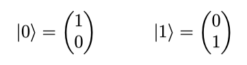
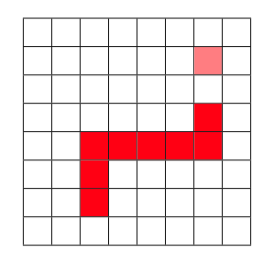
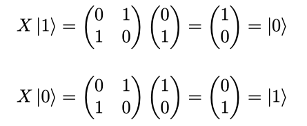
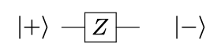
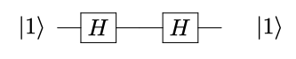

# Quantum Snake
Classic Snake [game](main.py) for the Pew Pew with integrated quantum stuff.

The Pew Pew offers the following features:
* 8x8 pixel screen
* 4 (3) levels of brightness
* 6 buttons
* python
* microqiskit

The struggle was not to have any game ideas, but what can
be deployed to an 8x8 pixel screen. An even bigger question is,
how to use quantum stuff inside a game that fits these
requirements.

## Controls
* `UP`, `DOWN`, `LEFT`, `RIGHT`: What they're supposed to do.
* Try to avoid turning the snake inside out.
* `X`: Apply a [NOT gate](#not-gate) to the food.
* `O`: Apply a [Hadamard gate](#hadamard-gate) to the food.

## Food
The quantum danger noodle feasts on qubits. In this game, there
are three types of food:
* NOT food and food  
  

* Hadamarded food  
  

They are represented by 100% (food), 0% (NOT food) and 50% (Hadamarded food) brightness.

  
  
  

## Random
In the game, new food is placed randomly. This part can be
made quantum. The new random function uses a Hadamard gate on a single qubit to get a random bit.

The Hadamard gate creates a qubit that is a superposition of |0&rang; and
|1&rang;. When measuring the qubit, the state collapses into 0
or 1, with equal probability.

Since microqiskit only allows 1 or 2 qubits, the random function
uses one measurement of the above cirquit per bit needed.

Now that we have random bits, what can we use this for?
* Place food: x and y coordinate, &forall; x, y &isin; \[0, 7\] and therefore 3 bits of random per coordinate.
* Initial state of food: 4 possibilities and therefore 2 bits of random
* Place snake: same as food coordinates
* initial direction of snake: same as food state

## NOT gate
Food is initialized randomly. Applying the NOT gate (`X`) to
food |1&rang;  will result in |0&rang;, or also NOT food.

NOT food has the effect of starving the snake by one pixel.
If you starve the quantum nope rope to death, the game is over.

Since it is NOT food, it is also NOT visible. You'll have to
memorize where the qubit was.

With Hadamarded food, the (`X`) button acts as a Z gate. 

Is does technically the same, but in the Z basis. This is not
visible on the Hadamarded food, but will show effect when
applying a Hadamard gate again.

## Hadamard gate
We can also apply a Hadamard gate to the food, by pressing
(`O`). This will get us Hadamarded food. 

For food, we can see that the Hadamard gate creates a
superposition of NOT food and negative food

For NOT foood, the Hadamard gate creates a superposition of NOT food
and food

When the snake eats the Hadamarded food, it will become food or
NOT food, decided by our quantum randomness.

## Sources
Basic game inspired by [snake.py](stateWhenIGotIt/snake.py), that was provided with the Pew Pew.
