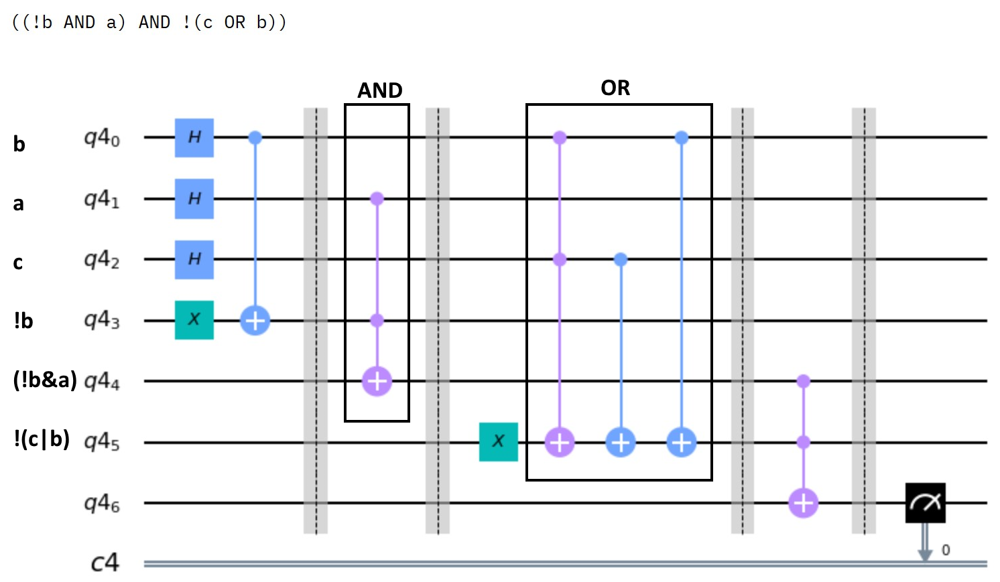

# SAT solver

This SAT-solver can build, run and evaluate quantum circuits for valid formulas.

## How to use
The entire manual to this tool can be found within the notebook. To open the notebook, you can download and use it. I've tried to setup a [mybinder](https://mybinder.org/) repository, but I didn't manage to use qiskit nor matlibplot from within there, so I'll leave that for now.

## Example 1
### Input
"a & !b"

### Output
Initial formula: a & !b  
Expected probability: 0.25  
Actual Probability 0.21875  

There is most probably a solution.

### Explanation of the Output
Expected probability is the probability of one output out of 2^#variables being 1.  
#variables is the number of distinct variables. (#variables of "((!a|a)&!(b&c)) | (!b|c)" is 3 == #{a,b,c}.)  
In the example above, there are 2 variables, and so 1 / (2^2) = 0.25 is the expected probability. If the actual probability is higher than that, then a solution has been found. If not, then no solution has been found.  
For error mitigation, the actual bar is half of the expected probability. In the example it is 0.125.

### Circuit

  

## Example 2
### Input
"((!b AND a) AND !(c OR b))"

### Output
Initial formula: ((!b AND a) AND !(c OR b))  
Expected probability: 0.125  
Actual Probability 0.0  
  
There is most probably NO solution.  

### Explanation of the Output
Expected probability is the probability of one output out of 2^#variables being 1.  
#variables is the number of distinct variables. (#variables of "((!a|a)&!(b&c)) | (!b|c)" is 3 == #{a,b,c}.)  
In the example above, there are 3 variables, and so 1 / (2^3) = 0.125 is the expected probability. If the actual probability is higher than that, then a solution has been found. If not, then no solution has been found.  
For error mitigation, the actual bar is half of the expected probability. In the example it is 0.0625.

### Circuit

  

